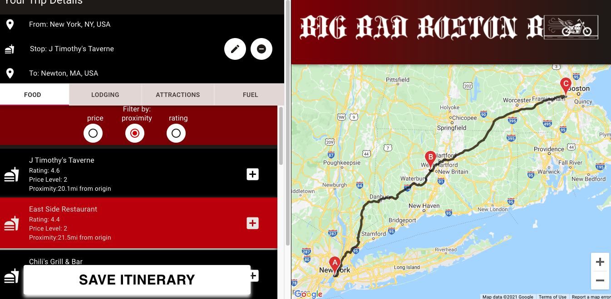
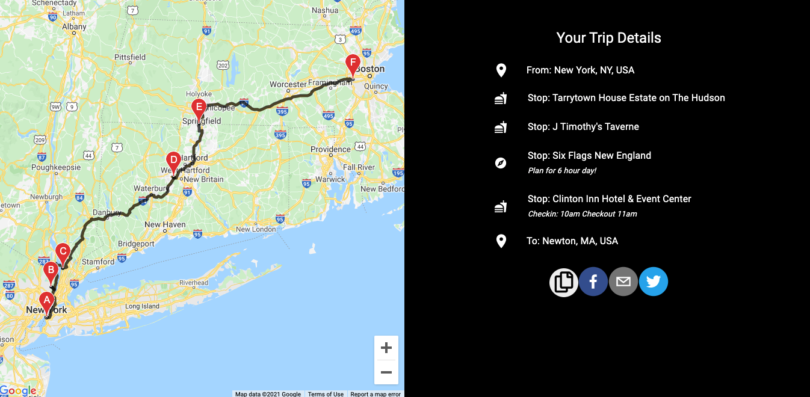

# The Big Bad Boston Bikers Trip Planning Application
## Created by the Blue Ocean Team

### Contributors
- [David Backer (UI Owner)](https://github.com/DBDavidBacker)
- [Nastassia Fulconis (Architecture Owner)](https://github.com/nastassiafulconis)
- [Tim Kang](https://github.com/tikangcs)
- [Christina Kirk (Product Manager)](https://github.com/KirkNotCaptain)
- [Zachary Lewitton](https://github.com/zlewitton)
- [Anton Menchaca (UI Owner)](https://github.com/amenchaca100)
- [Eddy Santos](https://github.com/EddySantos07)

7 Software Engineers designed and deployed a fullstack trip planning application for a the Big Bad Boston Bikers in 7 days.

The MVP goals of this application were to allow users to plan a trip, receive suggestions for places to stop along the way, and then both save and share the trip with others via social media and email.

---

## Table of Contents
[Running the Server](#running-the-server)

[Technologies Used](#technologies-used)

[Requirements](#requirements)

[Landing Page](#landing-page)

[Trip Planning Dashboard](#trip-planning-dashboard)

[Itinerary Page](#itinerary-page)

---

## Running the Server
- Set up Environment variables in an .env file
  - API_KEY: restricted API Key from the Google API, needs to have access to the Directions API, Distance Matrix API, Geocoding API, Geolocation API, Maps JavaScript API and the Places API
  - API_KEY2: un-restricted API Key from the Google API, needs to have access to the API's listed above
  - IP_ADDRESS: set to the server's computer's IP Address or `localhost` if running on local computer
- run `docker-compose up` to build the database, server and front end client
- navigate to `IP_ADDRESS:3000`

---

## Technologies Used
> Back end
- [Node.js](https://nodejs.org/en/)
- [Express](http://expressjs.com/)
- [Mongodb](https://www.mongodb.com/)

> Front End
- [React](https://reactjs.org/)
- [Redux](https://react-redux.js.org/)
- [Material UI](https://material-ui.com/)

> Deployment
- [Docker](https://www.docker.com/)
- [AWS EC2](https://aws.amazon.com/)

---

## Requirements
Ensure that the following modules are installed before running docker-compose

- Docker version 20.10.5 or higher
- docker-compose version 1.28.5 or higher

---

## Landing Page
The landing page is where users can enter the origin and destination of their trip. Users can click the white travel icon to allow Google to use their current location as the starting point.

The From and To fields utilize Google's Geolocation Service to auto-suggest locations based on user input. Once the user has chosen a start and destination, they can click the "Let's Ride" button to move to the trip planning dashboard.

> 
---

## Trip Planning Dashboard

The Trip Dashboard is where users can view and modify their trip. Double clicking on the map will generate a list of nearby stops within 30mi of the clicked location. These stops are either food vendors, lodging options, tourist destinations, or gas stations. The nearby areas can be sorted by price, proximity to the origin location and rating.

Users can add any of these suggestions to their trip by clicking on the plus icon. This will update both the map's route and the Trip Details section to include the new destination. The stop can then be removed by clicking the minus icon in the trip planning section.

Users may also add comments to their stop by clicking the pen icon in the Trip Details section. Once users have finished adding stops to their trip, they can click the "save itinerary button" to navigate to the itinerary page.

<!-- They can remove the stop from their trip by selecting the remove icon near the stop. The destinations in the trip details will always reflect the order displayed on the route.  -->

> 
---

## Itinerary Page
Once the user has selected all of their stops and added any optional comments, they will arrive at the Itinerary page which presents them with a summary of their trip. The left side of the page includes an interactive map which displays all their stops. The right side of the page displays the text overview of their trip. Users have the ability to share this summary page with one of the four share buttons, which will either copy the page URL to the clipboard, or else provide a template for users to share the page on Facebook, Twitter, or via email.

> 
